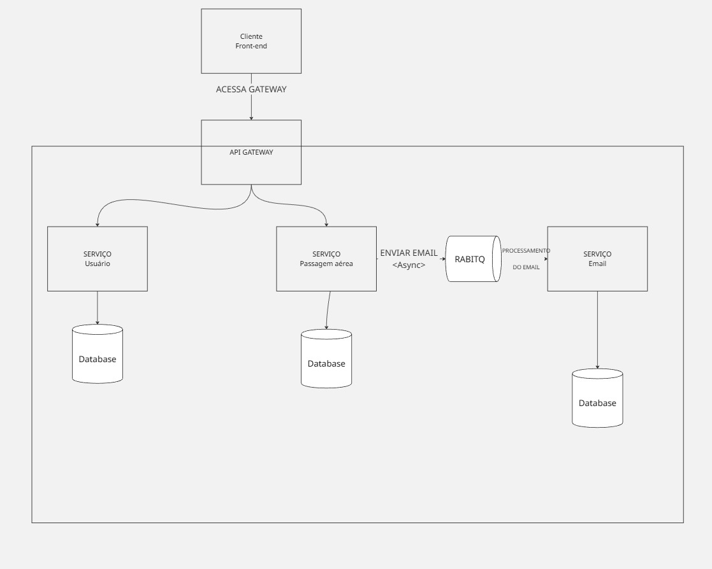

1. Descrição do problema
  O sistema previsto para realizar o processamento de passagem aérea de um usuário.
2. Objetivo do sistema 
   - 
   Registrar/entrar usuário
   Consultar Voos
   Comprar Passagem
   Consultar Passagem de um usário
   Realizar Processamento do Email de Confirmação
   
3. Estilo arquitetural adotado
   
   Estilo adotado foi de arquitetura orientada a serviços (SOA), tendo os seguintes serviços: user, companinha_area (o principal que realiza a consulta de voos) e email (enviar email para usuario).

4. Diagrama simples da arquitetura (imagem ou ASCII)
   
 
   
5. Justificativa das decisões arquiteturais
   
  Foi escolhido o SOA, pois, os serviços podem ser reutilizados em outros contextos, os serviços são independentes, logo,  eles tem baixo acoplamento, contribuindo para a manutenção do projeto.
   
6. Instruções para execução do projeto
   
  Para executar o projeto é necessário instalar inteliJJ, eclipse ou vsCode. Necessário instalado o JDK 25 para executação dos serviços.
  Após isso, abrir cada projeto separadamente e baixar as dependências dos respectivos pom's.xml. Após instalar todas as dependências, apenas rodar o RunApplication de cada serviço (cada está configurado com portas distintas, sendo 8081: user, 8082: passagens/voo e 8083: email).

  Agora com docker, é necessário primeiramente em cada projeto inicializar o build do docker. Entrando em cada serviço, rode no diretório do Dockerfile o comando:

  docker build -t 'nome_da_imagem' .

  Ele irá realizar as etapas do dockerFile, baixando as dependências e fazendo o build do java.
  Após isso, execute o comando para rodar a imagem do docker:
  
  docker run --env-file .env -p 8081:8081 'nome_da_imagem' 

  É necessário o .env file, pois existem as configurações da SECRET_KEY e a chave do RABBITMQ.
   
7. Nome completo: Pedro Henrique Bose Ximenes Pedrosa
