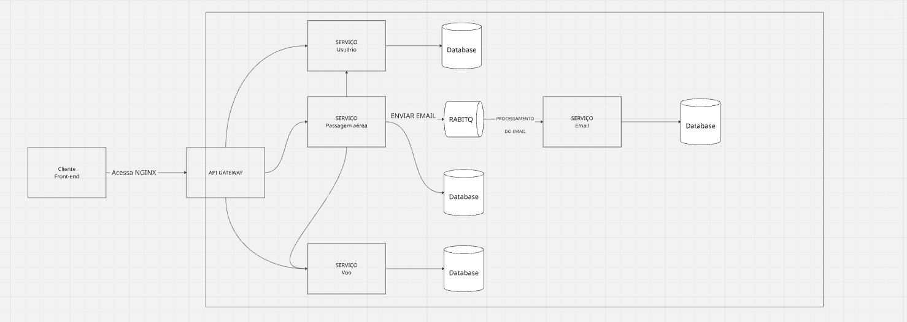
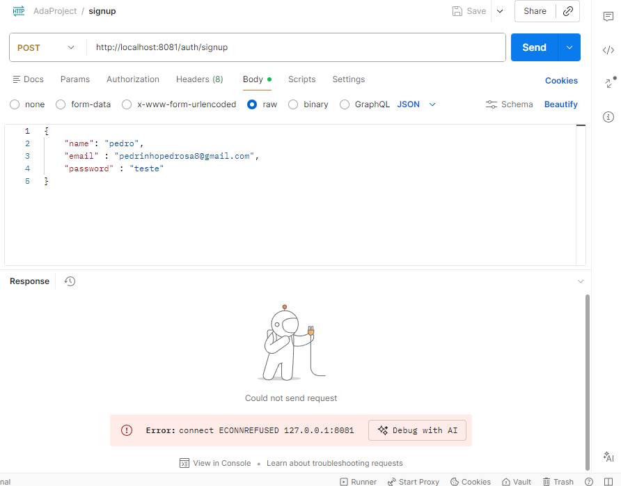
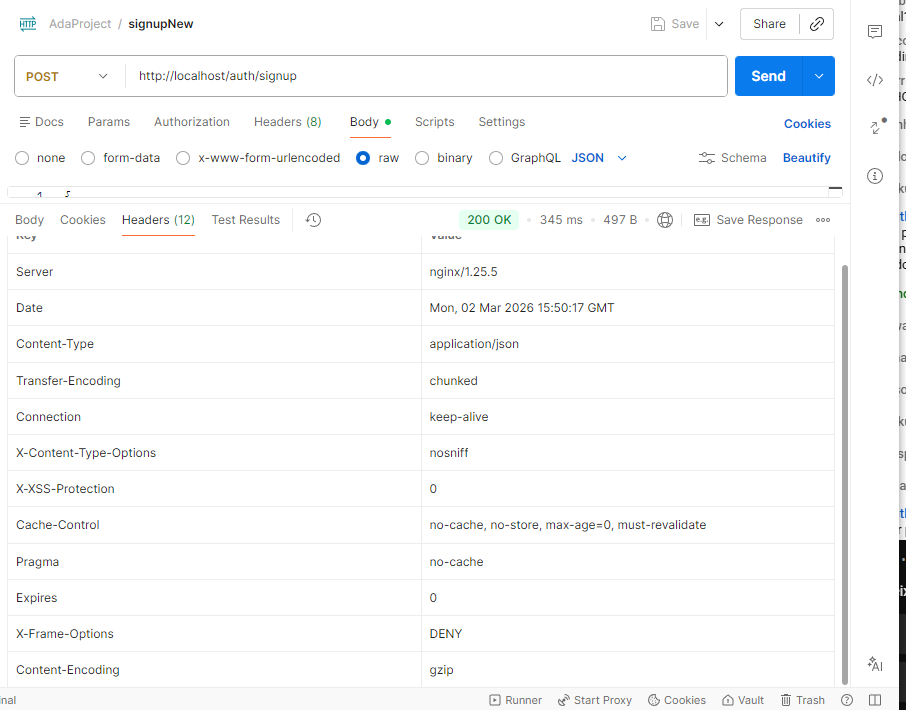
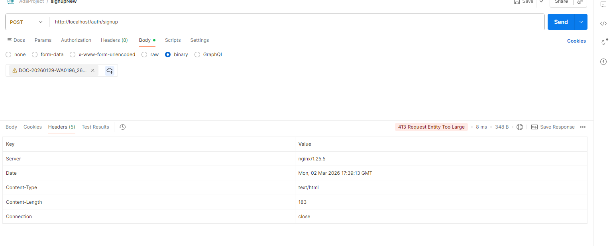
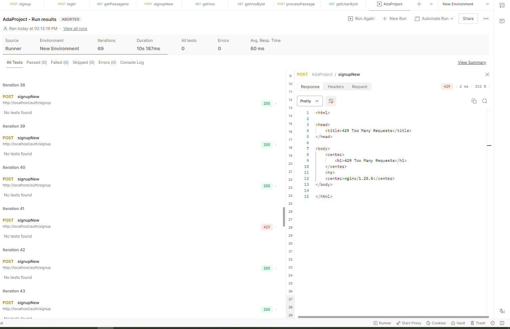
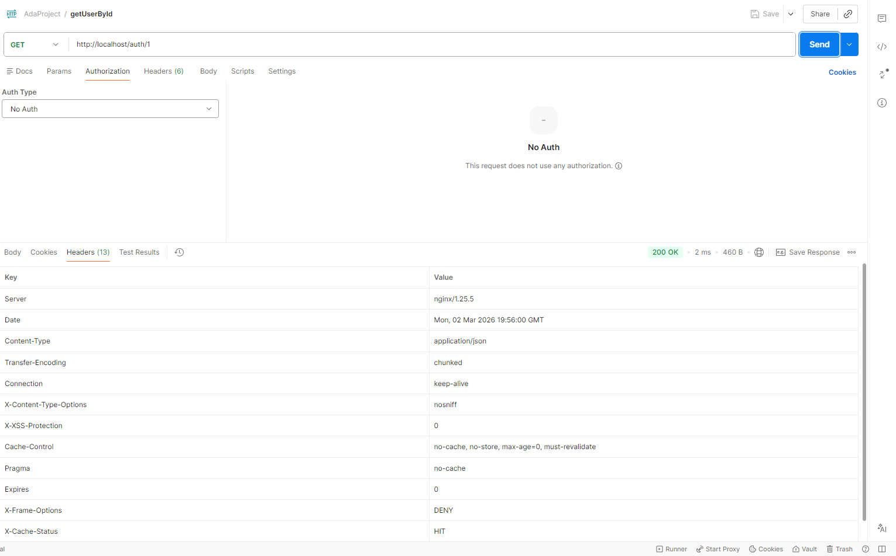
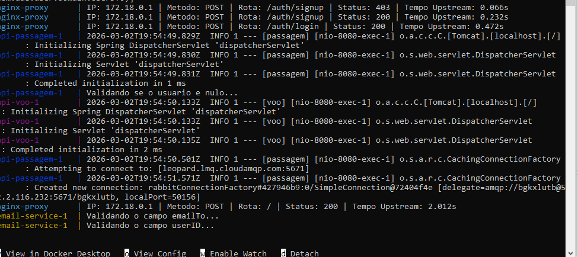

#  Sistema de Processamento de Passagens Aéreas

##  1. Descrição do Problema

O sistema foi desenvolvido para realizar o processamento de compra de passagens aéreas por um usuário, contemplando desde o cadastro até o envio do e-mail de confirmação.

---

##  2. Objetivo do Sistema

O sistema deve permitir:

- Registrar / autenticar usuário  
- Consultar voos  
- Comprar passagem  
- Consultar passagem de um usuário  
- Realizar processamento e envio de e-mail de confirmação  

---

##  3. Estilo Arquitetural Adotado

O estilo arquitetural adotado foi **Arquitetura Orientada a Serviços (SOA)**.

### Serviços implementados:

- **user** → Responsável pelo cadastro e autenticação de usuários  
- **passagem** → Serviço principal responsável pela compra de passagem 
- **voo** → Serviço principal responsável pela consulta de voos  
- **email** → Responsável pelo envio do e-mail de confirmação  

---

##  4. Diagrama da Arquitetura




##  6. Instruções para Execução do Projeto

###  Execução Local (Sem Docker)

### Pré-requisitos:

- IntelliJ, Eclipse ou VSCode  
- JDK 25 instalado  

### Passos:

1. Abrir cada projeto separadamente na IDE.
2. Baixar as dependências definidas nos arquivos `pom.xml`.
3. Executar a classe principal (`RunApplication`) de cada serviço.

### Portas utilizadas:

- **8081** → Serviço `user`
- **8082** → Serviço `passagem`
- **8083** → Serviço `voo`
- **8084** → Serviço `email`

---

## 🐳 Execução com Docker

### 1️⃣ Build da imagem

Para gerar as imagens do docker: Entre no diretório onde está o `Dockerfile` de cada serviço e execute:

```bash
docker build -t nome_da_imagem .
```

Para rodar todo o projeto com docker compose, entre no diretório raiz do projeto e execute:

```bash
docker compose up --build
```

## 7. Testes

Primeiro teste, consiste em tentar acessar o servidor pela porta do serviço (8081) e não por via do nginx porta 80.



O outro teste é os headers adicionado por segurança, em que é possível analisar na imagem a seguir.



O teste seguinte, limitar em 1MB o tamanho do arquivo.




O teste seguinte, limitar máximo de 5 requisições por segundo pelo mesmo IP, com burst permitido de 10.



O teste seguinte, inserção de cache por 10 segundos em requisições GET  sem autenticação .



O teste seguinte, o log da aplicação do nginx com IP do cliente, método HTTP, Status, Tempo de resposta.




## 8. Aluno

Pedro Henrique Bose Ximenes Pedrosa